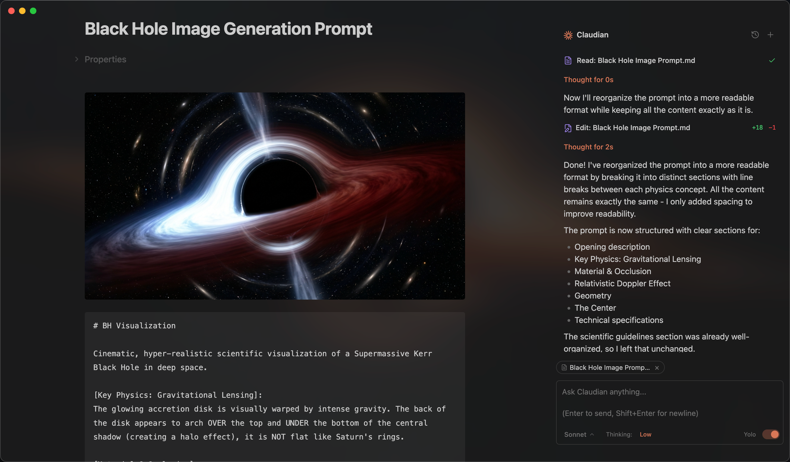

# Your Harness




A control harness for AI agents in Obsidian. It embeds AI coding agents (Claude Code, Codex, Opencode, Pi, and more to come) in your vault, making the vault their working directory for file read/write, search, bash, and multi-step workflows.

## Origin

Your Harness started as a fork of the excellent Claudian Obsidian plugin. Thank you, colleagues — your plugin is great!

Since then it has grown into its own plugin: roughly **+59% repository LOC** compared with the upstream baseline, plus new interaction patterns, telemetry, tab management, autocomplete, and test coverage. At that point, a separate name felt clearer than presenting it as a small patch set.

## What this version adds

- **Cumulative session usage** — provider-neutral token ledgers for conversations, shown on the latest assistant response and in the session status panel.
- **Codex telemetry support** — reads app-server and transcript token snapshots, computes cumulative deltas, and preserves usage across reloads.
- **OpenCode and Pi usage support** — normalizes provider usage into the same session ledger instead of provider-specific one-off displays.
- **Delegated worker attribution** — parses structured worker usage markers so child OpenCode Go runs can be attributed to the active parent turn without timestamp guessing.
- **Collapsible status panel** — compact session-level visibility for provider/model/usage state.
- **Readable tab labels** — conversation titles on tab badges by default, with longer expanded labels and a setting to return to numeric tabs.
- **Better tab operations** — tab rename context menu, drag-and-drop reordering, next/previous-tab commands, wrapped tab bar, and longer tab title limits.
- **Vault path autocomplete** — `@` mentions understand slash navigation, immediate children, mid-path matching, and file/folder suggestions backed by tests.
- **Slash-command and skill UX improvements** — better `$`/`/` dropdown behavior and vault-path-aware suggestions.
- **Keyboard/input polish** — tmux-style prefix controls, bash-like keybindings, and safer textarea resizing behavior.
- **Test coverage for the new behavior** — unit and integration tests for usage ledgers, worker markers, tab behavior, vault paths, provider telemetry, and the renamed plugin UI.

## Features & Usage

Open the chat sidebar from the ribbon icon or command palette. Select text and use the hotkey for inline edit. Everything works like your familiar coding agent, Claude Code, Codex, Opencode, and Pi — talk to the agent, and it reads, writes, edits, and searches files in your vault.

**Inline Edit** — Select text or start at the cursor position + hotkey to edit directly in notes with word-level diff preview.

**Slash Commands & Skills** — Type `/` or `$` for reusable prompt templates or Skills from user- and vault-level scopes.

**`@mention`** - Type `@` to mention anything you want the agent to work with, vault files, subagents, MCP servers, or files in external directories.

**Plan Mode** — Toggle via `Shift+Tab`. The agent explores and designs before implementing, then presents a plan for approval.

**Instruction Mode (`#`)** — Refined custom instructions added from the chat input.

**MCP Servers** — Connect external tools via Model Context Protocol (stdio, SSE, HTTP). Claude manages vault MCP in-app; Codex uses its own CLI-managed MCP configuration.

**Multi-Tab & Conversations** — Multiple chat tabs, conversation history, fork, resume, and compact.

## Requirements

- **Claude provider**: [Claude Code CLI](https://code.claude.com/docs/en/overview) installed (native install recommended). Claude subscription/API or compatible provider ([Openrouter](https://openrouter.ai/docs/guides/guides/claude-code-integration), [Kimi](https://platform.moonshot.ai/docs/guide/agent-support), etc.).
- **Optional providers**: [Codex CLI](https://github.com/openai/codex), [Opencode](https://opencode.ai/), [Pi](https://github.com/earendil-works/pi).
- Obsidian v1.7.2+
- Desktop only (macOS, Linux, Windows)

## Installation

Your Harness is **not published in the Obsidian Community Plugins directory yet**. Install it manually from GitHub.

### Manual install from GitHub release

1. Download `main.js`, `manifest.json`, and `styles.css` from the [latest GitHub release](https://github.com/anatoly-m-maslennikov/obsidian-your-harness/releases/latest).
2. Create a folder called `your-harness` in your vault's plugins folder:
   ```
   /path/to/vault/.obsidian/plugins/your-harness/
   ```
3. Copy the downloaded files into the `your-harness` folder.
4. In Obsidian, open Settings → Community plugins → Installed plugins and enable **Your Harness**.

### Install from source

1. Clone this repository into your vault's plugins folder:
   ```bash
   cd /path/to/vault/.obsidian/plugins
   git clone https://github.com/anatoly-m-maslennikov/obsidian-your-harness.git your-harness
   cd your-harness
   ```

2. Install dependencies and build:
   ```bash
   npm install
   npm run build
   ```

3. In Obsidian, open Settings → Community plugins → Installed plugins and enable **Your Harness**.

### Development

```bash
# Watch mode
npm run dev

# Production build
npm run build
```

## Privacy & Data Use

- **Sent to API**: Your input, attached files, images, and tool call outputs. Default: Anthropic (Claude), OpenAI (Codex), or the provider configured in Opencode/Pi; configurable via provider settings and environment variables.
- **Local storage**: Your Harness settings and session metadata in `vault/.claudian/` (legacy storage path kept for compatibility); Claude provider files in `vault/.claude/`; transcripts in `~/.claude/projects/` (Claude), `~/.codex/sessions/` (Codex), and `.pi/agent/sessions/` or `~/.pi/agent/sessions/` (Pi).
- **Environment variables**: Provider subprocesses inherit the Obsidian process environment plus any variables you configure in Your Harness. This is needed for CLI authentication, proxies, certificates, and PATH resolution.
- **Device-specific paths**: Per-device CLI paths use an opaque local key stored in browser local storage, not your system hostname.
- **Background activity**: Your Harness does not run telemetry beacons. UI polling timers read local Obsidian/editor selection state only. Network activity is limited to explicit provider runtime work, configured MCP endpoints, and provider SDK/CLI calls needed to answer your requests.

## Troubleshooting

### Claude CLI not found

If you encounter `spawn claude ENOENT` or `Claude CLI not found`, the plugin can't auto-detect your Claude installation. Common with Node version managers (nvm, fnm, volta).

**Solution**: Leave the setting empty first so Your Harness can auto-detect Claude Code. If auto-detection fails, find your CLI path and set it in Settings → Advanced → Claude CLI path.

| Platform | Command | Example Path |
|----------|---------|--------------|
| macOS/Linux | `which claude` | `/Users/you/.volta/bin/claude` |
| Windows (native) | `where.exe claude` | `C:\Users\you\AppData\Local\Claude\claude.exe` |
| Windows (npm) | `npm root -g` | `{root}\@anthropic-ai\claude-code\cli-wrapper.cjs` |

> **Note**: On Windows, avoid `.cmd` and `.ps1` wrappers. Use `claude.exe` for native installs, or `cli-wrapper.cjs` for package-manager installs. `cli.js` is only a legacy fallback for older Claude Code npm packages.

**Alternative**: Add your Node.js bin directory to PATH in Settings → Environment → Custom variables.

### npm CLI and Node.js not in same directory

If using npm-installed CLI, check if `claude` and `node` are in the same directory:
```bash
dirname $(which claude)
dirname $(which node)
```

If different, GUI apps like Obsidian may not find Node.js.

**Solutions**:
1. Install native binary (recommended)
2. Add Node.js path to Settings → Environment: `PATH=/path/to/node/bin`

### Other providers

Codex, Opencode, and Pi support are live but features might be incomplete, and still need more testing across platforms and installation methods. If you have feature request or run into any bugs, please [submit a GitHub issue](https://github.com/anatoly-m-maslennikov/obsidian-your-harness/issues).

## Architecture

```
src/
├── main.ts                      # Plugin entry point
├── app/                         # Shared defaults and plugin-level storage
├── core/                        # Provider-neutral runtime, registry, and type contracts
│   ├── runtime/                 # ChatRuntime interface and approval types
│   ├── providers/               # Provider registry and workspace services
│   ├── auxiliary/               # Shared provider auxiliary services
│   ├── bootstrap/               # Plugin bootstrap wiring
│   ├── security/                # Approval utilities
│   └── ...                      # commands, mcp, prompt, storage, tools, types
├── providers/
│   ├── claude/                  # Claude SDK adaptor, prompt encoding, storage, MCP, plugins
│   ├── codex/                   # Codex app-server adaptor, JSON-RPC transport, JSONL history
│   ├── opencode/                # Opencode adaptor
│   ├── pi/                      # Pi RPC adaptor, model discovery, JSONL history
│   └── acp/                     # Agent Client Protocol shared transport
├── features/
│   ├── chat/                    # Sidebar chat: tabs, controllers, renderers
│   ├── inline-edit/             # Inline edit modal and provider-backed edit services
│   └── settings/                # Settings shell with provider tabs
├── shared/                      # Reusable UI components and modals
├── i18n/                        # Internationalization (10 locales)
├── types/                       # Shared ambient types
├── utils/                       # Cross-cutting utilities
└── style/                       # Modular CSS
```

## License

Licensed under the [MIT License](LICENSE).

## Acknowledgments

- [Obsidian](https://obsidian.md) for the plugin API.
- The original Claudian project for the foundation this fork started from.
- [Anthropic](https://anthropic.com) for Claude and the [Claude Agent SDK](https://platform.claude.com/docs/en/agent-sdk/overview).
- [OpenAI](https://openai.com) for [Codex](https://github.com/openai/codex).
- [Opencode](https://opencode.ai/).
- [Pi](https://github.com/earendil-works/pi).
